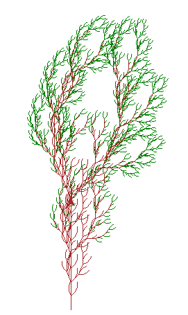
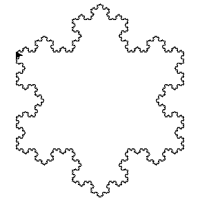
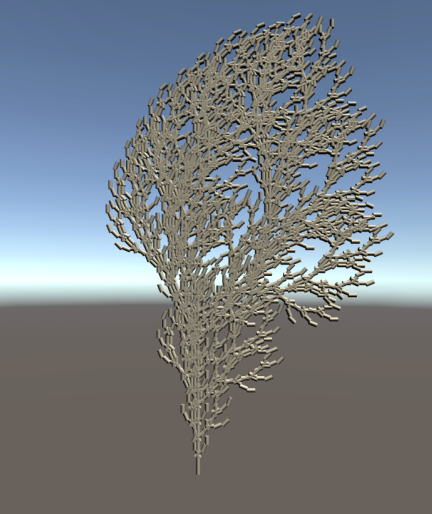
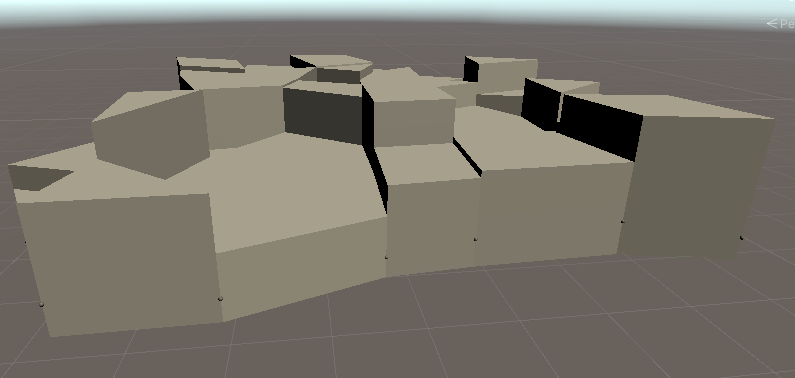

# ProceduralGen

Projet de recherche documentaire au laboratoire de recherche [XLIM](https://www.xlim.fr/) sur le
sujet de la génération procédurale de terrain, végétation et paysages urbains. Ce repository
contient plus précisément l'application de nos recherches documentaires, via Unity3D. Le rapport de
recherche de ce projet est disponible sur [Google Drive](https://docs.google.com/document/d/1fG0lSWKF_zscjAJkibbIZ-Cgd8h_D87heLsh84emyHk/edit?usp=sharing). 

# Fonctionnalités implémentées

- Placement d'intersections
- Détermination des voisins
- Suppression arbitraire de triangles
- Mise en pratique des cartes orientées
- Extrusion des faces
- Insertion des faces manquantes

# Résultats obtenus

|    |       |
| :--------------------: | :-----------------------: |
|  |  |

# Auteurs 

- [Vincent COMMIN](https://github.com/Altimors)
- [Louis LEENART](https://github.com/TheBoje)
- [Thomas LUNETEAU](https://github.com/thbl088)
